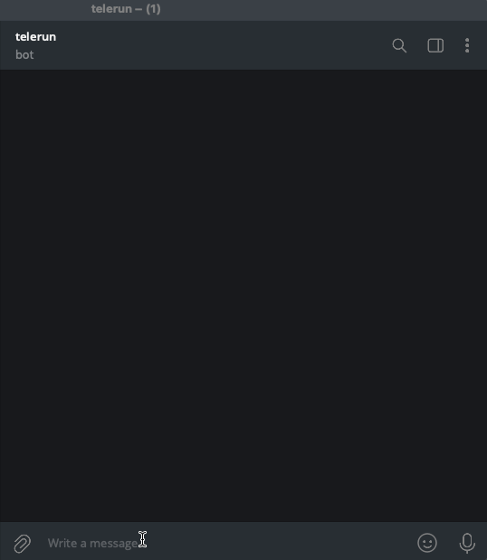
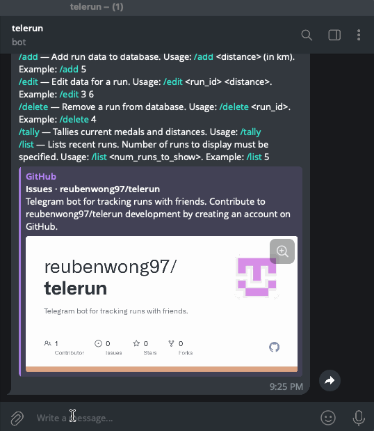
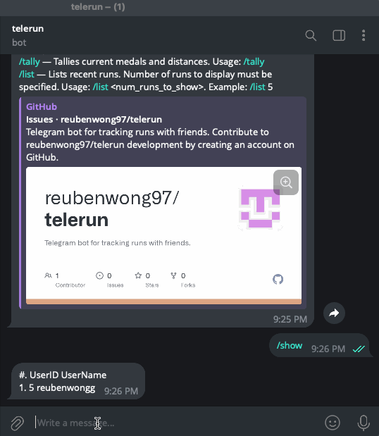
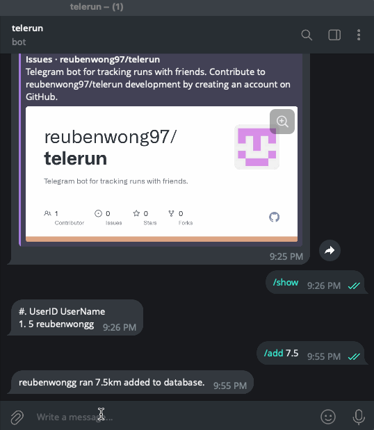
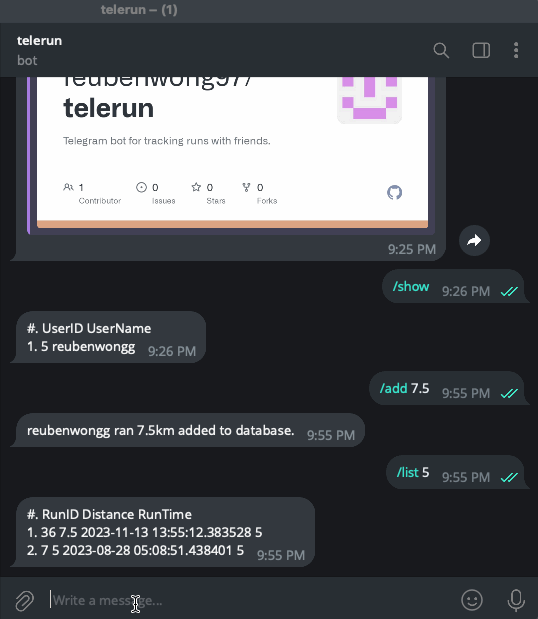
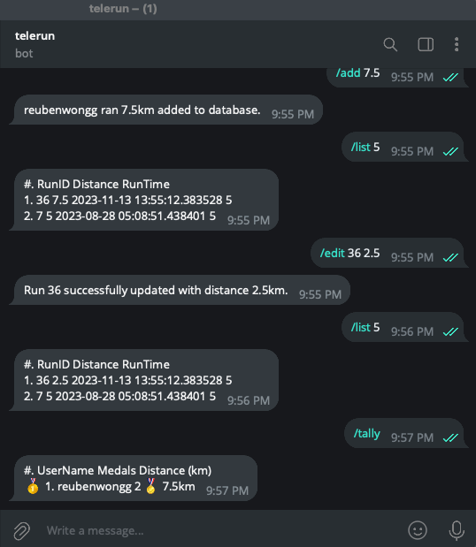
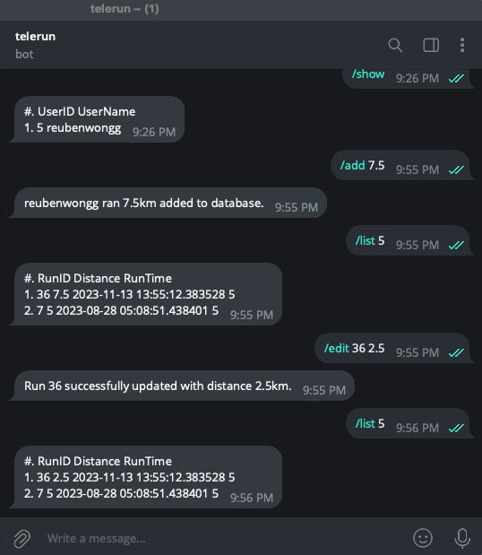

[](https://github.com/reubenwong97/telerun)

# Telerunbot

This project was born out of an idea from my brother - he wanted something simple to gamify workouts with friends. Therefore, I developed this telegram bot to allow them to track their runs in a leaderboard. This bot groups leaderboards by telegram chats, and each individual chat would have its own leaderboard! This allows you to use this bot among multiple friend circles - each with their own leaderboards.

## Usage

The instructions below assume you are using the bot I am hosting. If you decide to [host the bot yourself](#self-hosting), replace the bot you are adding to the group with your bot instead.

### Adding the Bot

You can communicate directly with the bot if you only want to track your own runs privately. Simply start chatting with the [telerun](https://t.me/TeleRunTrackBot) bot.

If you want to track runs for a chat group, add [telerun](https://t.me/TeleRunTrackBot) to the chat group. Once done, it will immediately be ready for listening to commands.

### Available Commands

#### Help

This will display a basic help message, with the various commands supported by the bot and how to use them. To see this message, just type `/help`.



#### Show

This will display a list of users who are in this group chat. To see this message, just type `/show`.



#### Add

This adds a single run to be tracked by the bot. As an example, if I wanted to add that I ran 2.5km, I would enter `/add 2.5`. You will get a response from the bot that the run you entered is now tracked.



#### List

This command allows you to view the runs that you have added to this particular chat group. To do so, you must use the list command, **together** with the number of runs you want to see (in descending order). If you want to view your last 5 runs: `/list 5`. This is useful when used together with commands that edit run data, like [edit](#edit) or [delete](#delete).



#### Edit

The `edit` command allows you to edit the distance ran for a particular run. The syntax of this command is: `/edit <run_id> <run_distance>`.



#### Delete

The `delete` command allows you to remove a run from being tracked. The syntax of this command is `/delete <run_id>`.



#### Tally

Finally, the `/tally` command displays the leaderboard.



## Self-Hosting

Due to resource constraints, I encourage you to self-host this bot should you wish to do so! Its simple to get started, you simply need the Free tier on [shuttle.rs](https://www.shuttle.rs/). Shuttle will then provision the resources necessary to operate this bot.

After you have signed up for an account on shuttle, you will need to do the following:

```bash
# Install shuttle cli
cargo install cargo-shuttle

# Login
cargo shuttle login

# Initialise project
cargo shuttle init --no-framework
```

You can then proceed to clone the repository, making the necessary changes to `Cargo.toml` to reflect the correct meta-data of hosting your own bot service. You will then want to create a `Secrets.toml` file with the contents:

```toml
TELOXIDE_TOKEN = <TELEGRAM_BOT_API_TOKEN>
```

`TELEGRAM_BOT_API_TOKEN` is the API key of the telegram bot you are creating. For instructions on how to do so, please follow this [tutorial](https://core.telegram.org/bots/tutorial).

Viola! You have now hosted your own telerun bot service 🥳
